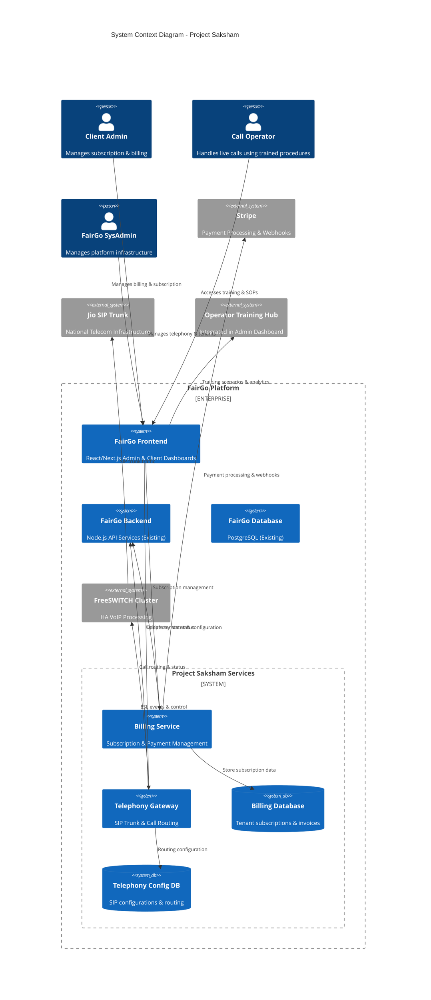
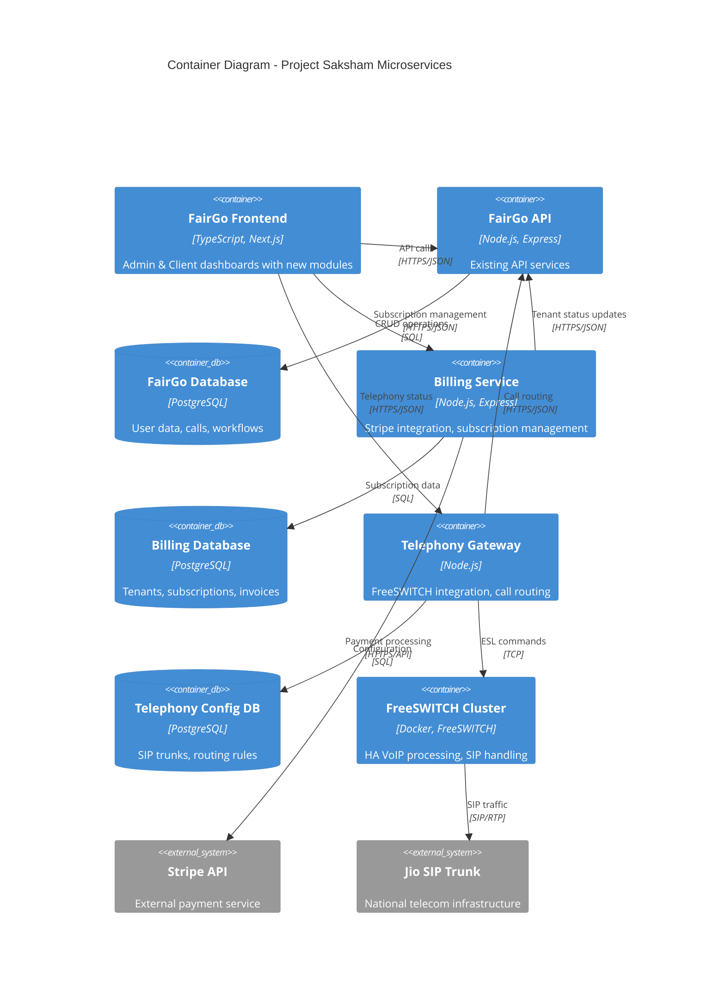
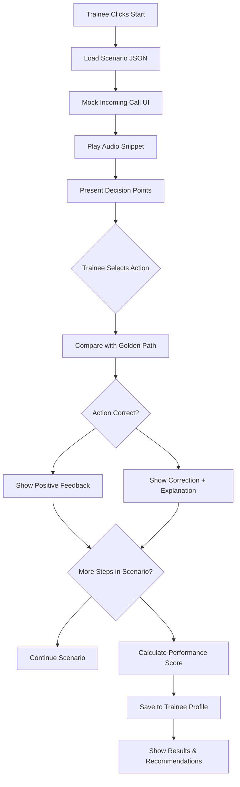

# 🏗️ **LEGENDARY BLUEPRINT: Project Saksham**
## **FairGo National Scale-Up: From Pilot to B2B SaaS Platform**

**Date:** November 11, 2025  
**Version:** 1.0  
**Classification:** Strategic Implementation Plan  
**Status:** Ready for Executive Approval  

---

## **📋 EXECUTIVE SUMMARY**

**Project Saksham** represents the transformation of FairGo AI IVR from a pilot platform into a commercially viable, national-scale B2B SaaS solution. This blueprint addresses the three critical "missing pieces" identified for national deployment:

1. **Telephony Gateway Service** - Self-hosted, high-availability infrastructure replacing CPaaS dependencies
2. **Operations Hub** - Comprehensive operator training and management system
3. **SaaS Billing & Onboarding** - Commercial platform with Stripe-powered subscriptions

**Total Investment Estimate:** ₹2.5-3.5 Cr (Development: ₹1.8 Cr, Infrastructure: ₹70L, Operations: ₹70L)  
**Timeline:** 6 months (MVP delivery in 4 months)  
**Architecture:** Microservices extension of existing platform  

---

## **🎯 I. OVERALL PROJECT & STRATEGY BLUEPRINTS**

### **1. MVP Checklist & Roadmap (Project Saksham)**

#### **🎪 EPICS BREAKDOWN**
```
┌─────────────────────────────────────────────────────────────────┐
│                    PROJECT SAKSHAM ROADMAP                       │
├─────────────────────────────────────────────────────────────────┤
│  PHASE 1 (Months 1-2): Foundation & Billing                     │
│  PHASE 2 (Months 2-4): Telephony & Operations                   │
│  PHASE 3 (Months 4-6): Scale, Testing & Launch                  │
└─────────────────────────────────────────────────────────────────┘
```

**EPIC 1: SaaS Billing & Onboarding (Workstream 3)**
- **Priority:** P0 (Critical Path)
- **Dependencies:** Stripe account setup, Legal compliance
- **Deliverables:** Billing service, Client onboarding flow, Admin billing dashboard

**EPIC 2: Operator Training Hub (Workstream 2)**
- **Priority:** P1 (Parallel Development)
- **Dependencies:** Existing admin dashboard
- **Deliverables:** Training simulator, SOP management, Performance analytics

**EPIC 3: Telephony Gateway Integration (Workstream 1)**
- **Priority:** P1 (Parallel Development)
- **Dependencies:** Jio SIP trunk procurement, FreeSWITCH setup
- **Deliverables:** Telephony service, HA infrastructure, Routing engine

#### **📋 USER STORIES (MoSCoW Prioritization)**

**MUST-HAVE (MVP Requirements):**
- ✅ "As a Client Admin, I can select a subscription plan, enter my credit card, and activate my account."
- ✅ "As a FairGo Admin, I can see the real-time registration status (Up/Down) of the Jio SIP Trunks."
- ✅ "As a Billing Service, I can receive a 'payment_failed' webhook from Stripe and update the tenant's status to 'past_due'."

**SHOULD-HAVE (Enhanced MVP):**
- 🔄 "As an Operator Trainee, I can run a 'simulated call' scenario from the dashboard and am guided through the correct SOP."
- 🔄 "As a FairGo Admin, I can define new routing rules for incoming calls in the `telephony-gateway-service`."

**COULD-HAVE (Post-MVP):**
- 📅 "As a Client Admin, I can view and download my past invoices."

**WON'T-HAVE (Future Releases):**
- ❌ "Automated, metered (per-call) billing."
- ❌ "Multi-tenant database isolation."
- ❌ "Advanced telephony features (call recording, conferencing)."

#### **📅 MILESTONE TIMELINE**
```
Month 1: Planning & Foundation
├── Week 1-2: Architecture design, team ramp-up
├── Week 3-4: Development environment setup

Month 2: Billing Service MVP
├── Week 1-2: Stripe integration, database schema
├── Week 3-4: Client onboarding flow, testing

Month 3: Parallel Development
├── Billing: Webhook handling, admin dashboard
├── Telephony: FreeSWITCH integration, basic routing
├── Operations: Training simulator foundation

Month 4: Integration & Testing
├── End-to-end testing, performance validation
├── Security audit, compliance checks

Month 5: Staging & UAT
├── Production-like environment testing
├── Client beta testing, feedback integration

Month 6: Production Launch
├── Go-live preparation, monitoring setup
├── Post-launch support, optimization
```

---

### **2. System Architecture Mermaid Diagram**





---

### **3. Ethical, Safety & Data Governance Plan**

#### **🛡️ DATA LINEAGE MAP**
```
Client Billing PII Flow:
1. Client Browser → Stripe Elements (Tokenization)
2. Stripe → Secure Token → fairgo.ai/pricing
3. fairgo.ai → billing-service API (/subscribe)
4. billing-service → Stripe API (create customer)
5. Stripe → customer_id → billing-service
6. billing-service → billing_db.tenants (stripe_customer_id)
7. NEVER: Raw CC numbers touch our servers

Emergency Call Data Flow:
1. Jio SIP Trunk → FreeSWITCH Cluster
2. FreeSWITCH → ESL Events → telephony-gateway-service
3. telephony-gateway-service → Health Metrics → FairGo IVR
4. FairGo IVR → Graceful Degradation (if telephony down)
```

#### **⚠️ ETHICAL RISK REGISTER**
| Risk ID | Risk Description | Impact | Probability | Mitigation Strategy |
|---------|------------------|--------|-------------|-------------------|
| TEL-001 | Telephony failure causes emergency call drops | Critical (P1) | Medium | HA FreeSWITCH cluster, RTO <60s, automated failover |
| BILL-001 | Incorrect billing leads to client disputes | High | Low | TDD for all billing logic, Stripe audit logs |
| TRAIN-001 | Ineffective training causes poor operator performance | Medium | Low | Real anonymized scenarios, performance analytics |
| DATA-001 | Billing PII data breach | Critical | Low | PCI compliance, Stripe tokenization only |
| HA-001 | Single point of failure in telephony | Critical | Medium | Multi-node FreeSWITCH cluster, health monitoring |

#### **📋 FORMAL DATA GOVERNANCE POLICY**

**Data Ownership & Stewardship:**
- **Billing Data Owner:** `billing-service` team (Lead: Backend Engineer)
- **Telephony Data Owner:** `telephony-gateway-service` team (Lead: DevOps Engineer)
- **Training Data Owner:** Operations team (Lead: Product Manager)

**Access Control Matrix:**
| Data Type | Client Admin | FairGo Admin | Service Accounts |
|-----------|-------------|--------------|------------------|
| Own Billing Data | ✅ Full | ❌ None | ❌ None |
| Other Client Data | ❌ None | ✅ Full | ❌ None |
| Telephony Config | ❌ None | ✅ Full | ✅ Read |
| Training Content | ❌ None | ✅ Full | ✅ Read/Write |

**Retention & Deletion:**
- **Billing Data:** 7 years (legal requirement)
- **Telephony Logs:** 90 days rolling
- **Training Analytics:** 2 years
- **Deletion Process:** Automated via retention policies, manual override requires approval

---

## **🎨 II. FRONTEND BLUEPRINTS (Mobile App & Websites)**

### **4. Frontend & Mobile App UX/UI Master Plan**

**Scope Decision:** No new mobile applications required for MVP. Focus remains on web-based admin and client dashboards.

**Design System Evolution:**
- **Existing:** FairGo's current design system (shadcn/ui + Tailwind)
- **Enhancements:** New billing-specific components, telephony status widgets
- **Accessibility:** WCAG 2.1 AA compliance for all new components
- **Responsive:** Mobile-first approach for admin dashboards

---

### **5. Landing Page Structure Plan (SaaS Onboarding)**

#### **🎯 PAGE: fairgo.ai/pricing**
**URL Structure:** `fairgo.ai/pricing` → `fairgo.ai/signup/{plan}` → `fairgo.ai/onboard`

#### **📱 BLOCK-BY-BLOCK WIREFRAME**

**1. Hero Section**
```
┌─────────────────────────────────────────────────────────────┐
│  🚀 A National-Scale Platform for Your Dispatch Needs       │
│                                                             │
│  Join 500+ businesses already using FairGo for reliable,   │
│  AI-powered dispatch operations across India.               │
│                                                             │
│  [Start Your 14-Day Free Trial]  [Contact Sales]           │
│                                                             │
│  ✓ 99.9% Uptime SLA          ✓ 24/7 Support                 │
│  ✓ Jio Telecom Integration   ✓ AI-Powered IVR               │
└─────────────────────────────────────────────────────────────┘
```

**2. Plan Comparison Grid**
```
┌─────────────────┬─────────────────┬─────────────────┬─────────────────┐
│ Feature         │ Pilot           │ Professional    │ Enterprise      │
│                 │ ₹2,999/month    │ ₹9,999/month    │ Custom          │
├─────────────────┼─────────────────┼─────────────────┼─────────────────┤
│ Operators       │ 5               │ 25              │ Unlimited       │
│ Monthly Calls   │ 1,000           │ 10,000          │ Unlimited       │
│ Training Hub    │ ❌              │ ✅              │ ✅              │
│ Custom Routing  │ ❌              │ ❌              │ ✅              │
│ SLA             │ 99%             │ 99.9%           │ 99.95%          │
│ Support         │ Email           │ Phone + Email   │ Dedicated       │
├─────────────────┼─────────────────┼─────────────────┼─────────────────┤
│ [Select Plan]   │ [Select Plan]   │ [Select Plan]   │ [Contact Sales] │
└─────────────────┴─────────────────┴─────────────────┴─────────────────┘
```

**3. Feature Comparison Table**
```markdown
| Feature Category | Pilot | Professional | Enterprise |
|------------------|-------|--------------|------------|
| **Core IVR** | | | |
| AI Voice Agents | ✅ | ✅ | ✅ |
| Malayalam Support | ✅ | ✅ | ✅ |
| Custom Workflows | ✅ | ✅ | ✅ |
| **Operations** | | | |
| Training Simulator | ❌ | ✅ | ✅ |
| Performance Analytics | ❌ | ✅ | ✅ |
| SOP Management | ❌ | ✅ | ✅ |
| **Telephony** | | | |
| Jio SIP Integration | ✅ | ✅ | ✅ |
| Custom Routing | ❌ | ❌ | ✅ |
| Call Recording | ❌ | ❌ | ✅ |
| **Billing & Support** | | | |
| Invoicing | Manual | Self-service | Self-service |
| Support | Email | Phone | Dedicated |
| SLA | 99% | 99.9% | 99.95% |
```

**4. Social Proof & Testimonials**
```
"Reduced our response time by 60% and costs by 40%"
- Rajesh Kumar, Operations Manager, Metro Cabs

"Malayalam support was a game-changer for our Kerala operations"
- Priya Menon, CEO, Kerala Logistics
```

#### **🔍 TECHNICAL SEO SPECIFICATIONS**
```json
{
  "@context": "https://schema.org",
  "@type": "SaaSApplication",
  "name": "FairGo AI IVR",
  "description": "National-scale AI-powered dispatch platform with Malayalam support",
  "offers": [
    {
      "@type": "Offer",
      "price": "2999",
      "priceCurrency": "INR",
      "name": "Pilot Plan"
    }
  ],
  "featureList": [
    "AI Voice Agents",
    "Malayalam Language Support",
    "Jio SIP Integration",
    "Operator Training Hub"
  ]
}
```

---

### **6. Frontend App Structure Plan (Changes to Admin)**

#### **📁 DIRECTORY TREE (New Additions)**
```
fairgo-admin-frontend/src/
├── features/
│   ├── billing/                          # Client Admin Features
│   │   ├── components/
│   │   │   ├── SubscriptionManager.tsx   # Plan selection & upgrades
│   │   │   ├── InvoiceList.tsx           # Invoice history & downloads
│   │   │   ├── PaymentMethodForm.tsx     # Stripe Elements integration
│   │   │   └── BillingAlerts.tsx         # Payment due notifications
│   │   ├── hooks/
│   │   │   ├── useSubscription.ts        # Subscription data & actions
│   │   │   └── useInvoices.ts            # Invoice management
│   │   └── pages/
│   │       └── BillingPage.tsx           # Main billing dashboard
│   │
│   ├── operator-training/                # FairGo Admin Features
│   │   ├── components/
│   │   │   ├── SimulatorWindow.tsx       # Interactive call simulation
│   │   │   ├── SopViewer.tsx             # SOP document viewer
│   │   │   ├── ScenarioBuilder.tsx       # Create training scenarios
│   │   │   └── PerformanceChart.tsx      # Analytics visualizations
│   │   ├── hooks/
│   │   │   ├── useTrainingScenarios.ts   # Scenario management
│   │   │   └── useOperatorMetrics.ts     # Performance tracking
│   │   └── pages/
│   │       └── TrainingHub.tsx           # Main training dashboard
│   │
│   └── telephony-gateway/                # SysAdmin Features
│       ├── components/
│       │   ├── SipTrunkStatus.tsx        # Real-time trunk status
│       │   ├── CallRoutingManager.tsx    # Routing rule editor
│       │   ├── TelephonyMetrics.tsx      # Call volume charts
│       │   └── FailoverStatus.tsx        # HA cluster health
│       ├── hooks/
│       │   ├── useTelephonyStatus.ts     # Trunk & routing status
│       │   └── useCallMetrics.ts         # Real-time metrics
│       └── pages/
│           └── TelephonyDashboard.tsx    # Main telephony dashboard
│
├── services/
│   ├── billingApi.ts                     # Billing service client
│   └── telephonyApi.ts                   # Telephony service client
│
└── types/
    ├── billing.ts                        # Billing-related types
    ├── telephony.ts                      # Telephony-related types
    └── training.ts                       # Training-related types
```

#### **🔄 STATE MANAGEMENT PLAN**
**Existing:** Zustand/Redux (assumed)
**New Requirements:**
- **Billing State:** Subscription status, payment methods, invoices
- **Telephony State:** Trunk status, routing rules, metrics
- **Training State:** Scenarios, operator progress, analytics

#### **🌐 API LAYER SPECIFICATIONS**
**React Query/SWR Integration:**
```typescript
// Billing Hooks
const useSubscription = () => {
  return useQuery({
    queryKey: ['subscription'],
    queryFn: () => billingApi.getSubscription(),
    staleTime: 5 * 60 * 1000, // 5 minutes
  });
};

const useInvoices = () => {
  return useQuery({
    queryKey: ['invoices'],
    queryFn: () => billingApi.getInvoices(),
  });
};

// Telephony Hooks
const useTelephonyStatus = () => {
  return useQuery({
    queryKey: ['telephony-status'],
    queryFn: () => telephonyApi.getStatus(),
    refetchInterval: 30000, // Real-time updates
  });
};
```

---

## **📊 III. DASHBOARD BLUEPRINTS (Role-Specific)**

### **7. User Dashboard Plan (Client Admin)**

#### **🆕 NEW VIEW: "Account & Billing"**
**URL:** `/client/billing`
**Access:** Client Admins Only

#### **🎛️ WIDGETS CONFIGURATION**

**1. Current Plan Widget**
```
┌─────────────────────────────────────────────────────────────┐
│ 🏷️ Current Plan                                            │
├─────────────────────────────────────────────────────────────┤
│ Plan: Professional                                         │
│ Status: Active                                             │
│ Next Billing: Dec 15, 2025                                 │
│ Amount: ₹9,999/month                                       │
│                                                            │
│ [Upgrade Plan] [Cancel Subscription]                       │
└─────────────────────────────────────────────────────────────┘
```

**2. Payment Method Widget**
```
┌─────────────────────────────────────────────────────────────┐
│ 💳 Payment Method                                          │
├─────────────────────────────────────────────────────────────┤
│ **** **** **** 4242                                        │
│ Expires: 12/26                                            │
│                                                            │
│ [Update Payment Method]                                    │
└─────────────────────────────────────────────────────────────┘
```

**3. Invoice History Widget**
```
┌─────────────────────────────────────────────────────────────┐
│ 📄 Recent Invoices                                         │
├─────────────────────────────────────────────────────────────┤
│ ┌─────────────────────────────────────────────────────┐     │
│ │ Nov 15, 2025 │ Professional │ ₹9,999 │ [Download] │     │
│ ├─────────────────────────────────────────────────────┤     │
│ │ Oct 15, 2025 │ Professional │ ₹9,999 │ [Download] │     │
│ └─────────────────────────────────────────────────────┘     │
│                                                            │
│ [View All Invoices]                                        │
└─────────────────────────────────────────────────────────────┘
```

**4. Usage Summary Widget**
```
┌─────────────────────────────────────────────────────────────┐
│ 📊 Usage This Month                                        │
├─────────────────────────────────────────────────────────────┤
│ Calls Used: 7,250 / 10,000                                 │
│ Operators Active: 18 / 25                                  │
│ Training Sessions: 45                                      │
│                                                            │
│ ████████░░░░░░░░░░ 72.5%                                   │
└─────────────────────────────────────────────────────────────┘
```

---

### **8. Admin Dashboard Plan (FairGo SysAdmin / Operator Manager)**

#### **🆕 NEW VIEW 1: "Telephony Gateway" (SysAdmin)**
**URL:** `/admin/telephony`
**Access:** SysAdmins Only

**🎛️ WIDGETS:**
1. **SIP Trunk Status Grid**
2. **Active Call Volume Chart**
3. **FreeSWITCH Cluster Health**
4. **Call Routing Rules Manager**
5. **Emergency Failover Status**

#### **🆕 NEW VIEW 2: "Operations Hub" (Operator Manager)**
**URL:** `/admin/operations`
**Access:** Operator Managers

**🎛️ WIDGETS:**
1. **Trainee Roster & Progress**
2. **SOP Knowledge Base Editor**
3. **Simulator Scenario Builder**
4. **Operator Performance Analytics**
5. **Training Session Scheduler**

#### **🆕 NEW VIEW 3: "Tenant Billing" (SysAdmin)**
**URL:** `/admin/tenants`
**Access:** SysAdmins Only

**🎛️ WIDGETS:**
1. **All Tenants Table** (tenant_id, plan, billing_status)
2. **Revenue Analytics**
3. **Failed Payment Alerts**
4. **Subscription Churn Metrics**

---

## **⚙️ IV. BACKEND & API BLUEPRINTS**

### **9. Backend Architecture Plan**

#### **🏗️ NEW SERVICE 1: `billing-service`**
**Technology Stack:**
- **Runtime:** Node.js 18+ LTS
- **Framework:** Express.js with TypeScript
- **Database:** PostgreSQL with Prisma ORM
- **Queue:** Redis for webhook processing
- **Deployment:** Docker container

**Key Responsibilities:**
- Stripe webhook handling and processing
- Subscription lifecycle management
- Invoice generation and delivery
- Tenant status synchronization
- Payment method management

**Dependencies:**
```json
{
  "stripe": "^14.0.0",
  "express": "^4.18.0",
  "@prisma/client": "^5.0.0",
  "ioredis": "^5.3.0",
  "nodemailer": "^6.9.0"
}
```

#### **🏗️ NEW SERVICE 2: `telephony-gateway-service`**
**Technology Stack:**
- **Runtime:** Node.js 18+ LTS
- **Framework:** Fastify (high-performance)
- **Database:** PostgreSQL + Redis
- **Deployment:** Docker container

**Key Responsibilities:**
- FreeSWITCH ESL event processing
- SIP trunk health monitoring
- Call routing rule management
- Real-time metrics collection
- Failover coordination

**Dependencies:**
```json
{
  "fastify": "^4.0.0",
  "node-esl": "^0.2.0",
  "ioredis": "^5.3.0",
  "@prisma/client": "^5.0.0",
  "ws": "^8.0.0"
}
```

#### **🏗️ NEW INFRASTRUCTURE: `freeswitch_cluster`**
**Technology Stack:**
- **Base:** FreeSWITCH 1.10+
- **Container:** Docker
- **Orchestration:** Docker Compose (dev) / Kubernetes (prod)
- **Load Balancing:** HAProxy

**Configuration:**
- Multi-node cluster for high availability
- Jio SIP trunk integration
- ESL event socket enabled
- RTP proxy configuration

---

### **10. API Endpoint Specification (REST/GraphQL)**

#### **💳 BILLING SERVICE API**
```typescript
// Subscription Management
POST /api/v1/billing/subscribe
Body: { plan_id: string, payment_token: string }
Response: { subscription_id: string, status: string }

GET /api/v1/billing/subscription
Response: { subscription: Subscription, invoices: Invoice[] }

POST /api/v1/billing/portal
Body: { customer_id: string }
Response: { portal_url: string }

// Webhook Handling
POST /api/v1/billing/webhooks
Headers: { stripe-signature: string }
Body: Stripe webhook payload
Response: { received: true }

// Invoice Management
GET /api/v1/invoices
Query: { limit: number, offset: number }
Response: { invoices: Invoice[], total: number }

GET /api/v1/invoices/{id}/download
Response: PDF stream
```

#### **📞 TELEPHONY GATEWAY API**
```typescript
// Status Monitoring
GET /api/v1/telephony/status
Response: {
  trunks: [{ id: string, name: string, status: 'up'|'down', latency: number }],
  cluster: { health: 'healthy'|'degraded', nodes: NodeStatus[] }
}

GET /api/v1/telephony/metrics
Response: {
  active_calls: number,
  total_calls_today: number,
  failure_rate: number,
  avg_call_duration: number
}

// Configuration Management
GET /api/v1/telephony/routes
Response: { routes: RoutingRule[] }

POST /api/v1/telephony/routes
Body: { rules: RoutingRule[] }
Auth: SysAdmin only

PUT /api/v1/telephony/routes/{id}
Body: { rule: RoutingRule }
Auth: SysAdmin only

// Health Checks
GET /api/v1/health
Response: { status: 'ok', services: ServiceHealth[] }
```

---

### **11. Database Schema & Migration Plan**

#### **💾 BILLING DATABASE SCHEMA**
```sql
-- Tenants table (links to main FairGo system)
CREATE TABLE tenants (
  id SERIAL PRIMARY KEY,
  fairgo_tenant_id UUID UNIQUE NOT NULL,
  stripe_customer_id VARCHAR(255) UNIQUE,
  subscription_id VARCHAR(255) UNIQUE,
  plan_id VARCHAR(100) NOT NULL,
  subscription_status VARCHAR(50) DEFAULT 'trialing',
  created_at TIMESTAMP DEFAULT NOW(),
  updated_at TIMESTAMP DEFAULT NOW()
);

-- Subscription plans
CREATE TABLE plans (
  id VARCHAR(100) PRIMARY KEY,
  name VARCHAR(255) NOT NULL,
  description TEXT,
  price_id VARCHAR(255) NOT NULL, -- Stripe Price ID
  amount INTEGER NOT NULL, -- Amount in paisa (₹1 = 100)
  currency VARCHAR(3) DEFAULT 'INR',
  interval VARCHAR(20) DEFAULT 'month', -- month, year
  is_active BOOLEAN DEFAULT true
);

-- Invoices
CREATE TABLE invoices (
  id SERIAL PRIMARY KEY,
  tenant_id INTEGER REFERENCES tenants(id),
  stripe_invoice_id VARCHAR(255) UNIQUE,
  amount INTEGER NOT NULL,
  currency VARCHAR(3) DEFAULT 'INR',
  status VARCHAR(50) DEFAULT 'draft',
  due_date DATE,
  paid_at TIMESTAMP,
  created_at TIMESTAMP DEFAULT NOW()
);

-- Webhook events (for audit)
CREATE TABLE webhook_events (
  id SERIAL PRIMARY KEY,
  stripe_event_id VARCHAR(255) UNIQUE,
  event_type VARCHAR(100),
  event_data JSONB,
  processed_at TIMESTAMP,
  status VARCHAR(50) DEFAULT 'pending'
);
```

#### **📞 TELEPHONY CONFIG DATABASE SCHEMA**
```sql
-- SIP trunks
CREATE TABLE sip_trunks (
  id SERIAL PRIMARY KEY,
  name VARCHAR(255) NOT NULL,
  host VARCHAR(255) NOT NULL,
  port INTEGER DEFAULT 5060,
  credentials TEXT, -- Encrypted
  is_active BOOLEAN DEFAULT true,
  health_status VARCHAR(50) DEFAULT 'unknown',
  last_health_check TIMESTAMP,
  created_at TIMESTAMP DEFAULT NOW()
);

-- Routing rules
CREATE TABLE routing_rules (
  id SERIAL PRIMARY KEY,
  name VARCHAR(255) NOT NULL,
  priority INTEGER DEFAULT 0,
  conditions JSONB, -- Match criteria
  actions JSONB, -- Routing actions
  is_active BOOLEAN DEFAULT true,
  created_by INTEGER,
  created_at TIMESTAMP DEFAULT NOW()
);

-- Call logs (for analytics)
CREATE TABLE call_logs (
  id SERIAL PRIMARY KEY,
  call_id VARCHAR(255) UNIQUE,
  trunk_id INTEGER REFERENCES sip_trunks(id),
  direction VARCHAR(20), -- inbound, outbound
  status VARCHAR(50),
  duration INTEGER, -- seconds
  caller_id VARCHAR(50),
  destination VARCHAR(50),
  started_at TIMESTAMP,
  ended_at TIMESTAMP
);
```

#### **🔄 MIGRATION STRATEGY**
- **Tool:** Flyway for version-controlled migrations
- **Strategy:** Zero-downtime migrations with rollback plans
- **Testing:** Migration testing in staging environment
- **Backup:** Automatic backups before migrations

---

## **🛠️ V. DEPENDENCIES, OPERATIONS & QUALITY BLUEPRINTS**

### **12. Dependencies & Tooling Plan**

#### **📦 BILL OF MATERIALS (New Services)**
```json
// billing-service package.json
{
  "name": "billing-service",
  "dependencies": {
    "stripe": "^14.0.0",
    "express": "^4.18.0",
    "@prisma/client": "^5.0.0",
    "prisma": "^5.0.0",
    "ioredis": "^5.3.0",
    "nodemailer": "^6.9.0",
    "helmet": "^7.0.0",
    "cors": "^2.8.5",
    "joi": "^17.0.0",
    "winston": "^3.8.0"
  },
  "devDependencies": {
    "@types/express": "^4.17.0",
    "@types/cors": "^2.8.0",
    "@types/nodemailer": "^6.4.0",
    "typescript": "^5.0.0",
    "jest": "^29.0.0",
    "supertest": "^6.0.0"
  }
}

// telephony-gateway-service package.json
{
  "name": "telephony-gateway-service",
  "dependencies": {
    "fastify": "^4.0.0",
    "node-esl": "^0.2.0",
    "ioredis": "^5.3.0",
    "@prisma/client": "^5.0.0",
    "prisma": "^5.0.0",
    "ws": "^8.0.0",
    "helmet": "^7.0.0",
    "joi": "^17.0.0",
    "winston": "^3.8.0"
  }
}
```

#### **☁️ CLOUD SERVICES INTEGRATION**
- **Stripe:** Production account with webhook endpoints
- **Jio SIP Trunk:** Enterprise contract with technical specs
- **AWS/GCP/Azure:** Container registry, Kubernetes cluster
- **Monitoring:** DataDog or New Relic for observability

#### **🏠 LOCAL DEVELOPMENT ENVIRONMENT**
```yaml
# docker-compose.yml for development
version: '3.8'
services:
  billing-db:
    image: postgres:15
    environment:
      POSTGRES_DB: billing_dev
      POSTGRES_USER: billing_user
      POSTGRES_PASSWORD: billing_pass
    ports:
      - "5433:5432"

  telephony-db:
    image: postgres:15
    environment:
      POSTGRES_DB: telephony_dev
      POSTGRES_USER: telephony_user
      POSTGRES_PASSWORD: telephony_pass
    ports:
      - "5434:5432"

  redis:
    image: redis:7-alpine
    ports:
      - "6380:6379"

  freeswitch:
    image: custom-freeswitch:latest
    ports:
      - "5060:5060/udp"
      - "8021:8021"
    volumes:
      - ./freeswitch-config:/etc/freeswitch

  stripe-cli:
    image: stripe/stripe-cli:latest
    command: listen --forward-to billing-service:3001/api/v1/billing/webhooks
```

---

### **13. AI/ML Model & MLOps Plan**

#### **🎭 OPERATOR TRAINING SIMULATOR WORKFLOW**


#### **📊 SCENARIO JSON STRUCTURE**
```json
{
  "scenario_id": "emergency_vehicle_dispatch",
  "title": "Emergency Vehicle Dispatch",
  "difficulty": "intermediate",
  "language": "malayalam",
  "audio_file": "emergency_call_001.wav",
  "steps": [
    {
      "step_id": "greeting",
      "prompt": "Listen to the caller's emergency request",
      "options": [
        {"text": "എന്താണ് സംഭവിച്ചത്?", "correct": true},
        {"text": "ദയവായി കാത്തിരിക്കൂ", "correct": false}
      ],
      "feedback": {
        "correct": "Good empathetic greeting",
        "incorrect": "Always acknowledge emergency situations immediately"
      }
    }
  ],
  "golden_path_score": 85,
  "estimated_duration": 300
}
```

---

### **14. Deployment, CI/CD & Observability Plan**

#### **🚀 CI/CD PIPELINE SPECIFICATION**
```yaml
# .github/workflows/billing-service.yml
name: Billing Service CI/CD
on:
  push:
    branches: [main, develop]
    paths: [services/billing-service/**]

jobs:
  test:
    runs-on: ubuntu-latest
    steps:
      - uses: actions/checkout@v3
      - uses: actions/setup-node@v3
        with:
          node-version: '18'
      - run: npm ci
      - run: npm run lint
      - run: npm run test:unit
      - run: npm run test:integration
        env:
          STRIPE_SECRET_KEY: ${{ secrets.STRIPE_TEST_KEY }}

  build-and-deploy:
    needs: test
    runs-on: ubuntu-latest
    steps:
      - name: Build Docker Image
        run: docker build -t billing-service:${{ github.sha }} .
      - name: Push to ECR
        run: aws ecr get-login-password | docker login --username AWS --password-stdin ${{ secrets.ECR_URI }}
      - name: Deploy to Staging
        if: github.ref == 'refs/heads/develop'
        run: kubectl apply -f k8s/staging/
```

#### **📊 OBSERVABILITY STACK**
**Metrics Collection:**
- **Prometheus:** Service metrics, business KPIs
- **Grafana:** Dashboards for billing, telephony, operations
- **Custom Metrics:**
  - `billing_subscription_created_total`
  - `telephony_call_duration_seconds`
  - `training_scenario_completion_rate`

**Logging Strategy:**
- **Structured Logging:** Winston with JSON format
- **Central Aggregation:** ELK stack or CloudWatch
- **Log Levels:** ERROR, WARN, INFO, DEBUG

**Alerting Rules:**
- Billing: Failed payments > 5 in 1 hour
- Telephony: Trunk down > 5 minutes
- Operations: Training completion rate < 70%

#### **🛡️ DISASTER RECOVERY**
**RTO/RPO Targets:**
- **Billing Service:** RTO 4 hours, RPO 1 hour
- **Telephony Service:** RTO 1 hour, RPO 15 minutes
- **Training Data:** RTO 24 hours, RPO 1 hour

**Backup Strategy:**
- **Databases:** Daily automated backups with 30-day retention
- **Configuration:** GitOps with disaster recovery configs
- **Testing:** Quarterly DR drills

---

### **15. Mandatory TDD/BDD Workflow & Testing Plan**

#### **📊 TESTING PYRAMID**
```
END-TO-END (10%)
├── "Complete client signup flow"
├── "Operator training simulation"
└── "Telephony failover scenario"

INTEGRATION (20%)
├── "Stripe webhook processing"
├── "FreeSWITCH ESL event handling"
├── "Database transaction integrity"
└── "API contract validation"

UNIT (70%)
├── "Billing calculation logic"
├── "Routing rule evaluation"
├── "Training scenario scoring"
└── "Authentication middleware"
```

#### **🧪 CRITICAL TDD TEST CASES**
```typescript
// billing-service tests
describe('SubscriptionService', () => {
  test('should handle Stripe invoice.payment_failed webhook', async () => {
    const webhookPayload = createMockWebhook('invoice.payment_failed');
    const result = await subscriptionService.processWebhook(webhookPayload);
    
    expect(result.tenant.status).toBe('past_due');
    expect(result.invoice.status).toBe('uncollectible');
  });

  test('should prorate subscription changes correctly', async () => {
    const change = await subscriptionService.changePlan(tenantId, 'professional');
    expect(change.prorationAmount).toBeGreaterThan(0);
    expect(change.effectiveDate).toBeValidDate();
  });
});

// telephony-gateway-service tests
describe('RoutingEngine', () => {
  test('should route emergency calls to priority queue', async () => {
    const call = createMockCall({ emergency: true });
    const route = await routingEngine.routeCall(call);
    
    expect(route.queue).toBe('emergency');
    expect(route.priority).toBe('high');
  });
});
```

#### **🎲 CHAOS ENGINEERING SCENARIOS**
**GameDay Exercises:**
1. **"Stripe API Outage":**
   - **Trigger:** Block Stripe API calls
   - **Expected:** Queue webhooks, retry logic, graceful degradation
   - **Recovery:** Process queued events when API recovers

2. **"FreeSWITCH Node Failure":**
   - **Trigger:** Stop primary FreeSWITCH container
   - **Expected:** Automatic failover to secondary node, no call drops
   - **Recovery:** Primary node restart, traffic redistribution

3. **"Database Connection Loss":**
   - **Trigger:** Network partition between services and databases
   - **Expected:** Circuit breaker activation, cached responses
   - **Recovery:** Automatic reconnection, data consistency checks

---

## **🎯 EXECUTION ROADMAP**

### **Phase 1 (Months 1-2): Foundation**
- [ ] Complete architectural design review
- [ ] Set up development environments
- [ ] Establish Stripe and Jio integrations
- [ ] Create database schemas and migrations

### **Phase 2 (Months 2-4): Core Development**
- [ ] Implement billing-service MVP
- [ ] Build telephony-gateway-service
- [ ] Develop operator training simulator
- [ ] Integrate with existing FairGo platform

### **Phase 3 (Months 4-6): Testing & Launch**
- [ ] Comprehensive testing (unit, integration, e2e)
- [ ] Security and performance audits
- [ ] Production deployment and monitoring
- [ ] Go-live support and optimization

**Total Timeline:** 6 months  
**Go-Live Target:** Month 6  
**Success Metrics:** 100 tenants, 99.9% uptime, <2hr MTTR

---

**📝 APPROVAL CHECKLIST**
- [ ] Architecture Review Completed
- [ ] Security Assessment Approved  
- [ ] Budget Allocation Confirmed
- [ ] Team Capacity Verified
- [ ] Risk Mitigation Plans Accepted

**Project Saksham** is ready for implementation. The blueprint provides comprehensive coverage of all three workstreams with clear technical specifications, risk mitigation strategies, and quality assurance measures.

**Recommended Next Step:** Schedule executive review meeting to approve the blueprint and initiate Phase 1 development.